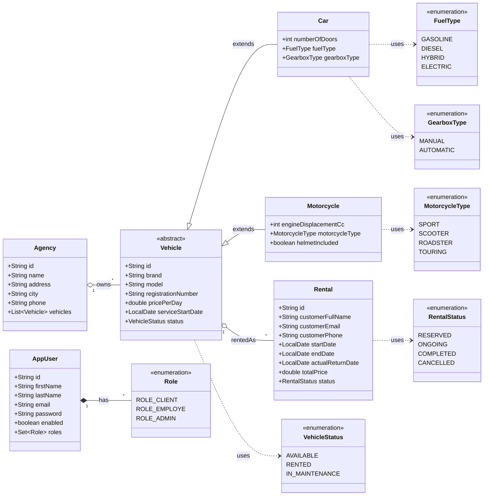
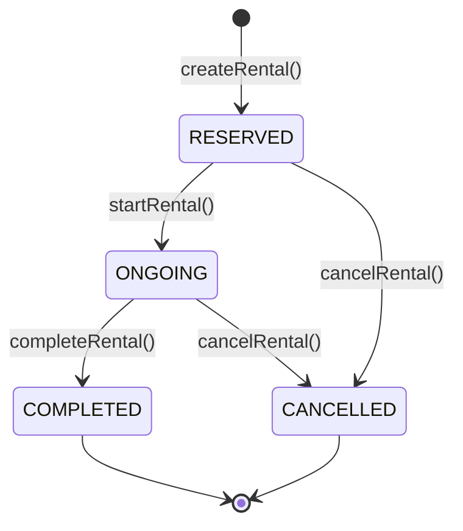
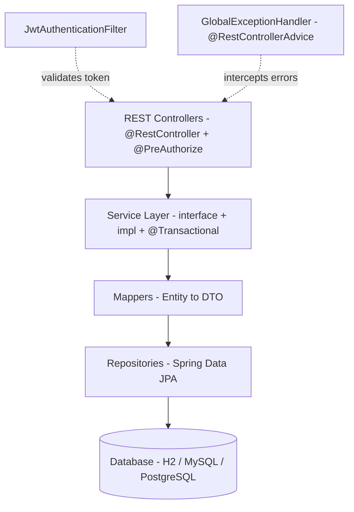

# Car Rental Application — JEE / Spring Boot + Angular

| | |
|---|---|
| **Student** | TOUBANI Badr Eddine |
| **Professor** | Mohamed YOUSSFI |
| **Field** | SDIA |
| **School** | ENSET |
| **Course** | Architecture JEE et Middleware |

Full-stack vehicle rental management application built with **Spring Boot** (REST API, JPA, JWT security) and **Angular 21** (standalone components, Bootstrap 5).

> Contact: `fadre6@gmail.com`

---

## Table of contents

1. [Functional scope](#1-functional-scope)
2. [Technical stack](#2-technical-stack)
3. [Repository layout](#3-repository-layout)
4. [Domain model](#4-domain-model)
5. [Backend architecture](#5-backend-architecture)
6. [REST API reference](#6-rest-api-reference)
7. [Security model (JWT + roles)](#7-security-model-jwt--roles)
8. [Frontend architecture](#8-frontend-architecture)
9. [Getting started](#9-getting-started)
10. [Demo accounts](#10-demo-accounts)
11. [Testing the API with Swagger](#11-testing-the-api-with-swagger)
12. [Technical report](#12-technical-report)

---

## 1. Functional scope

The application manages the rental of vehicles across agencies. It enforces the following business rules:

- An **agency** owns several **vehicles**; each vehicle belongs to a single agency.
- A vehicle is either a **car** or a **motorcycle** (single-table-per-class via JOINED inheritance).
- A vehicle may have many **rentals**, each rental concerns a single vehicle.
- Rental availability is enforced: overlapping reservations on the same vehicle are rejected.
- Three roles are supported: `ROLE_CLIENT`, `ROLE_EMPLOYE`, `ROLE_ADMIN`, each with distinct permissions.
- Public **registration** creates a `ROLE_CLIENT` account.

## 2. Technical stack

| Layer | Technology |
|---|---|
| Backend framework | Spring Boot 4.0.6 |
| Persistence | Spring Data JPA + Hibernate, H2 (in-memory) — switchable to MySQL/PostgreSQL |
| Web | Spring MVC REST controllers |
| Security | Spring Security 6 + JWT (`jjwt` 0.12.6) + BCrypt |
| API docs | springdoc-openapi 2.7.0 (Swagger UI) |
| Build | Maven + Maven Wrapper |
| Java | 17 |
| Frontend framework | Angular 21 (standalone components, signals, control flow blocks) |
| UI | Bootstrap 5.3 |
| HTTP | `HttpClient` with functional `HttpInterceptorFn` |
| State | Angular signals + `localStorage` (auth) |
| Build tools | Angular CLI 21, npm 11 |

## 3. Repository layout

```
Controle/
├─ CarLoacation/                      # Spring Boot backend
│  ├─ src/main/java/toubani/badreddine/carloacation/
│  │  ├─ entities/                    # JPA entities (Agency, Vehicle, Car, Motorcycle, Rental, AppUser)
│  │  ├─ enums/                       # VehicleStatus, FuelType, GearboxType, MotorcycleType, RentalStatus, Role
│  │  ├─ repositories/                # Spring Data JPA repositories
│  │  ├─ dto/                         # API contracts (DTOs)
│  │  │  └─ auth/                     # LoginRequest, RegisterRequest, AuthResponse
│  │  ├─ mappers/                     # Entity ↔ DTO mappers
│  │  ├─ services/ + services/impl/   # Service layer (interface + implementation)
│  │  ├─ exceptions/                  # ResourceNotFoundException, BusinessException
│  │  ├─ security/                    # JwtService, JwtAuthenticationFilter, AppUserDetailsService
│  │  ├─ config/                      # SecurityConfig, OpenApiConfig, DataInitializer
│  │  └─ web/                         # REST controllers + GlobalExceptionHandler
│  └─ src/main/resources/application.properties
│
└─ CarRentalFront/                    # Angular 21 frontend
   └─ src/app/
      ├─ accounts/                    # Agencies management page
      ├─ admin-template/              # Authenticated shell (navbar + router-outlet)
      ├─ customers/                   # Vehicles catalogue + booking flow
      ├─ guards/                      # Route guard (auth + role-based)
      ├─ interceptors/                # JWT interceptor (Authorization header + 401/403 handling)
      ├─ login/                       # Sign-in page
      ├─ model/                       # TypeScript interfaces and API constants
      ├─ navbar/                      # Top navigation bar
      ├─ new-custmer/                 # Sign-up page (creates ROLE_CLIENT)
      ├─ not-authorised/              # 403 page
      ├─ rentals/                     # Rentals management (EMPLOYE/ADMIN only)
      └─ services/                    # HTTP services (Authentication, Agency, Vehicle, Rental)
```

## 4. Domain model

### UML class diagram



### Rental state machine



**Inheritance strategy**: `InheritanceType.JOINED` on `Vehicle` — each subclass has its own table joined on the primary key. This favours normalization over read performance.

**Identifiers**: all entities use `String` UUIDs generated client-side (`UUID.randomUUID()`) for primary keys, enabling decoupling from DB sequences.

## 5. Backend architecture

The backend follows the classic JEE layered design:



### Key business rules implemented in `RentalServiceImpl`

- **Overlap detection**: `RentalRepository.findOverlappingRentals` rejects bookings whose `[startDate, endDate]` collides with any `RESERVED` or `ONGOING` rental on the same vehicle.
- **Status machine**: `RESERVED → ONGOING → COMPLETED` (or `CANCELLED`). Each transition automatically syncs the `VehicleStatus` (`AVAILABLE` ↔ `RENTED`).
- **Late-return pricing**: when `actualReturnDate > endDate`, extra days are charged at `pricePerDay`.
- **Maintenance lock**: a vehicle in `IN_MAINTENANCE` cannot be rented.

### Exception handling

Two domain exceptions (`ResourceNotFoundException`, `BusinessException`) are caught by `GlobalExceptionHandler` (`@RestControllerAdvice`) and mapped to HTTP status codes:

| Exception | HTTP status |
|---|---|
| `ResourceNotFoundException` | 404 Not Found |
| `BusinessException` | 409 Conflict |
| `IllegalArgumentException` | 400 Bad Request |
| `Exception` (catch-all) | 500 Internal Server Error |

Response body shape:
```json
{ "timestamp": "...", "status": 409, "error": "Conflict", "message": "..." }
```

## 6. REST API reference

Base URL: `http://localhost:8080/api`

### Authentication — `/api/auth` (public)

| Method | Path | Body | Description |
|---|---|---|---|
| POST | `/auth/register` | `RegisterRequest` | Create a `ROLE_CLIENT` account, returns JWT |
| POST | `/auth/login` | `LoginRequest` | Authenticate, returns JWT |

### Agencies — `/api/agencies`

| Method | Path | Roles | Description |
|---|---|---|---|
| POST | `/agencies` | ADMIN | Create an agency |
| PUT | `/agencies/{id}` | ADMIN | Update |
| DELETE | `/agencies/{id}` | ADMIN | Delete (fails if vehicles attached) |
| GET | `/agencies` | any auth | List, with optional `?city=` or `?name=` filter |
| GET | `/agencies/{id}` | any auth | Get one |
| GET | `/agencies/{id}/vehicles` | any auth | List vehicles of an agency |

### Vehicles — `/api/vehicles`, `/api/cars`, `/api/motorcycles`

| Method | Path | Roles | Description |
|---|---|---|---|
| GET | `/vehicles` | any auth | List, filter by `?status=` `?agencyId=` `?brand=` |
| GET | `/vehicles/available` | any auth | List `AVAILABLE` vehicles (optional `?agencyId=`) |
| GET | `/vehicles/{id}` | any auth | Get one |
| GET | `/vehicles/by-registration/{...}` | any auth | Lookup by plate |
| PATCH | `/vehicles/{id}/status` | EMPLOYE, ADMIN | Change status |
| PATCH | `/vehicles/{id}/agency/{agencyId}` | ADMIN | Reassign |
| DELETE | `/vehicles/{id}` | ADMIN | Delete |
| POST | `/cars?agencyId=` | EMPLOYE, ADMIN | Register a new car |
| PUT | `/cars/{id}` | EMPLOYE, ADMIN | Update a car |
| GET | `/cars`, `/cars/{id}` | any auth | Read cars |
| POST | `/motorcycles?agencyId=` | EMPLOYE, ADMIN | Register a new motorcycle |
| PUT | `/motorcycles/{id}` | EMPLOYE, ADMIN | Update a motorcycle |
| GET | `/motorcycles`, `/motorcycles/{id}` | any auth | Read motorcycles |

### Rentals — `/api/rentals`

| Method | Path | Roles | Description |
|---|---|---|---|
| POST | `/rentals` | CLIENT, EMPLOYE, ADMIN | Reserve a vehicle (with overlap check) |
| POST | `/rentals/{id}/start` | EMPLOYE, ADMIN | Switch to `ONGOING` |
| POST | `/rentals/{id}/complete` | EMPLOYE, ADMIN | Switch to `COMPLETED` (optional `?actualReturnDate=`) |
| POST | `/rentals/{id}/cancel` | EMPLOYE, ADMIN | Cancel |
| GET | `/rentals` | EMPLOYE, ADMIN | List, filter `?vehicleId=` `?customerEmail=` `?activeOnly=true` |
| GET | `/rentals/{id}` | EMPLOYE, ADMIN | Get one |
| GET | `/rentals/availability?vehicleId=&startDate=&endDate=` | any auth | Check availability |

### Polymorphic JSON

`VehicleDTO` is abstract with two concrete subtypes. Jackson uses a discriminator property:

```json
{
  "vehicleType": "CAR",
  "brand": "Renault",
  "model": "Clio",
  "numberOfDoors": 5,
  "fuelType": "DIESEL",
  "gearboxType": "MANUAL",
  ...
}
```

## 7. Security model (JWT + roles)

### Authentication flow

1. Client `POST /api/auth/login` with `{ email, password }`.
2. `AuthServiceImpl` delegates to `AuthenticationManager` (which uses `DaoAuthenticationProvider` + BCrypt).
3. On success, `JwtService` issues an HS256-signed JWT carrying `sub = email` and a `roles` claim.
4. Client stores the token (Angular: `localStorage`) and sends `Authorization: Bearer <token>` on every request.
5. `JwtAuthenticationFilter` (registered before `UsernamePasswordAuthenticationFilter`) parses the token, loads `UserDetails`, and populates the `SecurityContext`.
6. Method-level authorization via `@PreAuthorize` and `@EnableMethodSecurity`.

### Configuration knobs (`application.properties`)

```properties
app.jwt.secret=<base64-256-bit-key>
app.jwt.expiration-ms=86400000   # 24 hours
```

> The secret is base64-decoded then passed to `Keys.hmacShaKeyFor`. **Rotate this in production.**

### Public endpoints (no JWT required)

- `/api/auth/**`
- `/v3/api-docs/**`, `/swagger-ui/**`, `/swagger-ui.html`
- `/h2-console/**`
- `OPTIONS` (CORS preflight, all paths)

### Permission matrix

| Action | CLIENT | EMPLOYE | ADMIN |
|---|:--:|:--:|:--:|
| Sign up / Sign in | ✅ | ✅ | ✅ |
| Browse vehicles, agencies | ✅ | ✅ | ✅ |
| Reserve a vehicle | ✅ | ✅ | ✅ |
| Start / Complete / Cancel rental | ❌ | ✅ | ✅ |
| List all rentals | ❌ | ✅ | ✅ |
| Create / update vehicles | ❌ | ✅ | ✅ |
| Change vehicle status | ❌ | ✅ | ✅ |
| Create / update / delete agencies | ❌ | ❌ | ✅ |
| Reassign vehicle to another agency | ❌ | ❌ | ✅ |
| Delete vehicles | ❌ | ❌ | ✅ |

### CORS

A permissive CORS configuration is exposed (`*` origin patterns, all standard methods, `Authorization` exposed). Tighten this for production.

## 8. Frontend architecture

### State management

Authentication state is held by `AuthenticationService` using **Angular signals**:

```ts
private readonly _state = signal<AuthResponse | null>(restore());
readonly isLoggedIn = computed(() => this._state() !== null);
readonly roles = computed(() => this._state()?.roles ?? []);
```

Persistence is in `localStorage` so reloads keep the session. Tokens are read at request time by the interceptor.

### HTTP interceptor

`jwtInterceptor` (`HttpInterceptorFn`) injects the `Authorization` header and reacts to errors:
- `401`: logout + redirect to `/login`
- `403`: redirect to `/not-authorised`

### Routing & guards

```
/login              → Login (public)
/new-custmer        → NewCustmer (public, sign-up)
/not-authorised     → 403 page

/                   → AdminTemplate shell (authGuard)
  /                 → redirects to /customers
  /accounts         → Agencies
  /customers        → Vehicles + booking
  /rentals          → Rentals (authGuard with roles: EMPLOYE, ADMIN)
```

`authGuard` reads `data.roles` from the route definition and falls back to `/not-authorised` when the user lacks the required role.

### UI conventions

- Bootstrap 5 utility classes
- Standalone components, no NgModules
- Angular 21 control-flow blocks (`@if`, `@for`)
- `FormsModule` for two-way bindings (no Reactive Forms)
- Inline templates for compactness

## 9. Getting started

### Prerequisites

- JDK 17+
- Maven (or use the included Maven Wrapper `./mvnw`)
- Node 20+ and npm 10+

### Run the backend

```powershell
cd CarLoacation
.\mvnw spring-boot:run
```

The application boots on `http://localhost:8080`. On first startup, `DataInitializer` seeds three demo users (see below).

### Run the frontend

```powershell
cd CarRentalFront
npm install
ng serve            # or: npm start
```

Open `http://localhost:4200`.

### Switch database

To target MySQL or PostgreSQL, edit `application.properties`:

```properties
spring.datasource.url=jdbc:mysql://localhost:3306/carrental
spring.datasource.username=...
spring.datasource.password=...
spring.jpa.hibernate.ddl-auto=update
```

…and add the matching JDBC driver to `pom.xml`.

## 10. Demo accounts

| Email | Password | Roles |
|---|---|---|
| `fadre6@gmail.com` | `B@dr1599...` | ADMIN + EMPLOYE + CLIENT |
| `employee@demo.com` | `Employee@123` | EMPLOYE |
| `client@demo.com` | `Client@123` | CLIENT |

## 11. Testing the API with Swagger

- **Swagger UI**: http://localhost:8080/swagger-ui.html
- **OpenAPI spec (JSON)**: http://localhost:8080/v3/api-docs
- **H2 console**: http://localhost:8080/h2-console (JDBC URL: `jdbc:h2:mem:carrentaldb`)

### Suggested smoke test

1. `POST /api/auth/login` with the admin demo account → copy the `token`.
2. Click **Authorize** in Swagger and paste `Bearer <token>`.
3. `POST /api/agencies` → create an agency, copy its `id`.
4. `POST /api/cars?agencyId=<id>` → create a car (registration number unique).
5. `GET /api/vehicles/available` → the car is listed.
6. `POST /api/rentals` with `vehicleId` and dates → returns a `RESERVED` rental.
7. `POST /api/rentals/{id}/start` → status `ONGOING`, vehicle becomes `RENTED`.
8. `POST /api/rentals/{id}/complete` → status `COMPLETED`, vehicle back to `AVAILABLE`.

## 12. Technical report

### 12.1 Architecture decisions

| Topic | Decision | Rationale |
|---|---|---|
| Vehicle inheritance | `JOINED` strategy | Normalized schema; allows querying only `Car` or `Motorcycle` without polluting a shared table with nullable columns |
| Identifiers | Client-generated UUIDs (`String`) | Avoid sequence collisions; safe to expose in URLs; easy to seed deterministic test data |
| DTO polymorphism | Jackson `@JsonTypeInfo` discriminator | Single `GET /vehicles` endpoint returns a mixed list while preserving type info on the wire |
| Mapping | Hand-written `@Component` mappers | No MapStruct dependency; explicit, debuggable; supports PATCH-style partial updates via `updateEntity` |
| Service layer | Interface + impl pair | Standard for testability and AOP proxying |
| Auth state on frontend | Signals + `localStorage` | Reactive UI without RxJS subjects for state; survives reloads |
| Security secret | Base64 256-bit key in properties | Externalizable to env vars; HS256 is sufficient for a single-service deployment |
| Password hashing | BCrypt (default strength) | OWASP-recommended; built into Spring Security |
| Validation library | None for now | The user did not request `@Valid`; service layer enforces invariants explicitly |
| Open-in-view | Disabled | Avoids implicit lazy loading during view rendering and silences the Spring warning |

### 12.2 Business invariants enforced server-side

- **Unique registration number** on vehicle creation (`existsByRegistrationNumber` pre-check).
- **Unique email** on user registration.
- **No overlapping rentals** on a single vehicle (`@Query` with date-range predicate).
- **Status-driven transitions** in `RentalService` reject illegal moves (e.g. cancelling a completed rental).
- **Agency deletion** is blocked when vehicles remain attached.
- **Vehicle in `IN_MAINTENANCE`** cannot be booked.
- **Late-return surcharge**: `(actualReturnDate − endDate) × pricePerDay` added on completion.

### 12.3 Security hardening checklist (for production)

- [ ] Replace the default `app.jwt.secret` with a strong, externalized value (env var or Vault).
- [ ] Use HTTPS-only and `Secure` cookies if you move away from `localStorage`.
- [ ] Reduce CORS origins from `*` to the deployed frontend domain.
- [ ] Re-enable CSRF when using cookie-based sessions (not needed for stateless JWT in headers).
- [ ] Tighten `ddl-auto` to `validate` and manage schema with Flyway or Liquibase.
- [ ] Add a refresh-token flow (current implementation has only a 24 h access token).
- [ ] Add rate limiting on `/api/auth/login` to mitigate credential stuffing.
- [ ] Enable Spring Boot Actuator with proper authorization for ops endpoints.

### 12.4 Known limitations & next steps

| Topic | Current status | Suggested follow-up |
|---|---|---|
| Validation | None | Add `spring-boot-starter-validation`, annotate DTOs with `@NotBlank`/`@Email`/`@Future` etc., return field errors in `GlobalExceptionHandler` |
| Refresh tokens | Not implemented | Issue a long-lived refresh token, store its hash server-side |
| Auditing | Not implemented | Use `@EntityListeners(AuditingEntityListener.class)` + `@CreatedDate`/`@CreatedBy` for traceability |
| Rentals client view | EMPLOYE/ADMIN only | Add a "my rentals" endpoint filtered on the authenticated user's email |
| Frontend forms | Template-driven | Migrate to Reactive Forms for richer validation UX |
| Tests | Not yet authored | Add MockMvc tests for security rules, service-layer unit tests for the rental state machine |
| Database | H2 in-memory | Switch to PostgreSQL with Flyway migrations |
| Pagination | All endpoints return full lists | Adopt `Pageable` and return `Page<T>` |
| Internationalization | French/English mix | Centralize messages with `MessageSource` |

### 12.5 Operational notes

- The H2 database is in-memory; **all data is lost on restart**, and `DataInitializer` reseeds the three demo users on every boot.
- The frontend's `API_BASE_URL` is hard-coded in `src/app/model/model.ts`. Promote it to an Angular environment file (`environment.ts` / `environment.prod.ts`) when deploying.
- Spring Boot devtools is enabled — saving a Java file triggers an automatic restart.

---

© 2025 Badr Eddine Toubani — Educational project for the ENSET Spring + Angular module.
